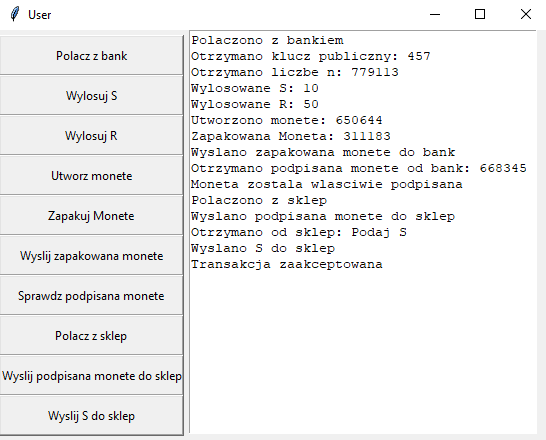
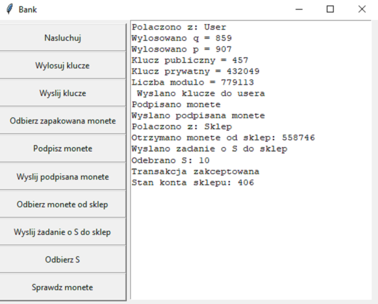
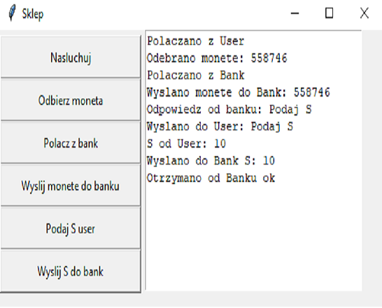

## Introduction
This project was programmed using python to pass subject at Warsaw University of Technology. The project includes three GUI applications (User, Shop, Bank) and is based on client-server model. 

It's a simple simulation of card payments in a shop. The RSA algorithm is used to ensure security during transactions

If you want to learn more, see the documentation

## Project demonstration

